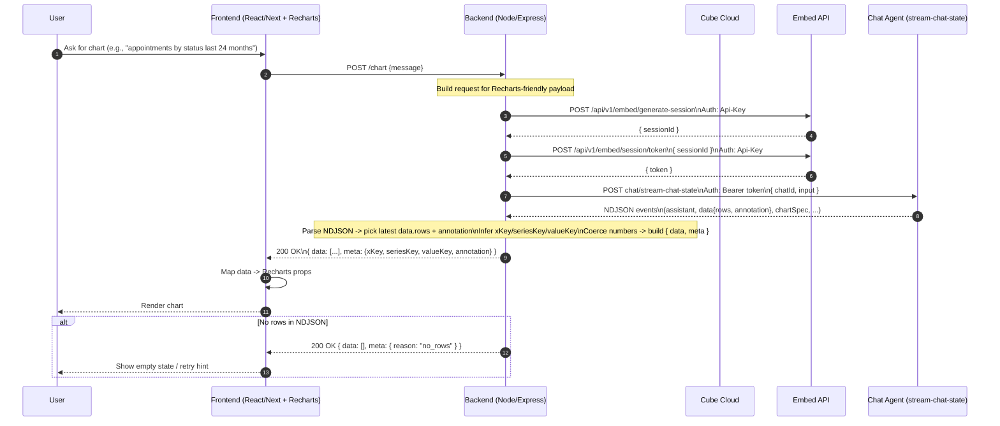

```mermaid
sequenceDiagram
  autonumber
  participant U as User
  participant FE as Frontend (React/Next + Recharts)
  participant BE as Backend (Node/Express)
  participant CC as Cube Cloud
  participant EMB as Embed API
  participant AG as Chat Agent (stream-chat-state)

  U->>FE: Ask for chart (e.g., "appointments by status last 24 months")
  FE->>BE: POST /chart {message}
  Note over BE: Build request for Recharts-friendly payload

  BE->>EMB: POST /api/v1/embed/generate-session\nAuth: Api-Key
  EMB-->>BE: { sessionId }

  BE->>EMB: POST /api/v1/embed/session/token\n{ sessionId }\nAuth: Api-Key
  EMB-->>BE: { token }

  BE->>AG: POST chat/stream-chat-state\nAuth: Bearer token\n{ chatId, input }
  AG-->>BE: NDJSON events\n(assistant, data{rows, annotation}, chartSpec, ...)

  Note over BE: Parse NDJSON -> pick latest data.rows + annotation\nInfer xKey/seriesKey/valueKey\nCoerce numbers -> build { data, meta }

  BE-->>FE: 200 OK\n{ data: [...], meta: {xKey, seriesKey, valueKey, annotation} }

  FE->>FE: Map data -> Recharts props
  FE-->>U: Render chart

  alt No rows in NDJSON
    BE-->>FE: 200 OK { data: [], meta: { reason: "no_rows" } }
    FE-->>U: Show empty state / retry hint
  end
```
